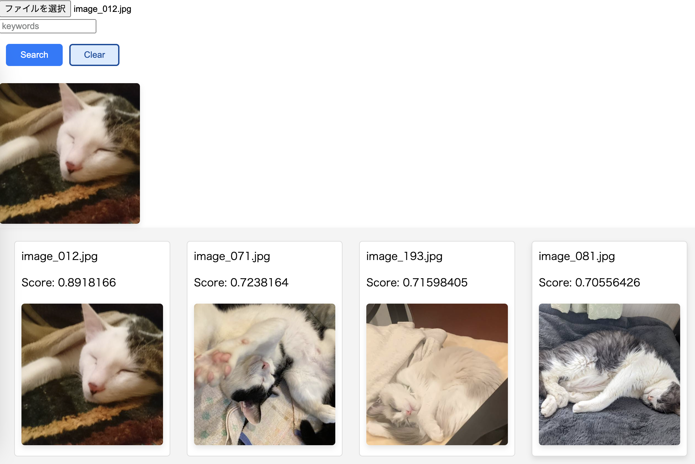
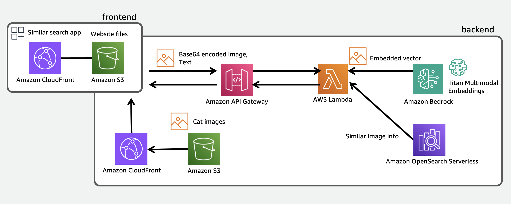

# 写真検索アプリ

Amazon Bedrock と Amazon OpenSearch Serverless を使って、以下のような写真を検索するアプリをデプロイするためのサンプルコードです。[このアプリの解説記事](https://aws.amazon.com/jp/builders-flash/202402/powerup-cat-image-search/) もあわせてご参照ください。

このサンプルで使用している猫さんたちの写真は、2022年のAWS Nyantechというイベントを開催した際に世界中の猫好きの方からいただいたものです。

## アーキテクチャ

アーキテクチャは以下のようになっています。

## デプロイ方法

デプロイ手順は [こちらのドキュメント](docs/HowToDeploy.md) で詳しく説明しています。

## カスタマイズ例

このサンプルをカスタマイズする場合に参考となる情報を [こちらのドキュメント](docs/HowToDevelop.md) に記載しています。

## 本番環境での利用に向けての注意

セキュリティは自身のポリシーに従って適切に評価、実装してください。その際は、[AWS Well-Architected](https://aws.amazon.com/jp/architecture/well-architected/?wa-lens-whitepapers.sort-by=item.additionalFields.sortDate&wa-lens-whitepapers.sort-order=desc) を参照するのがおすすめです。

AWS Well-Architected では、6 つの柱に対する確認項目が提供されています。

- オペレーショナルエクセレンス
- セキュリティ
- 信頼性
- パフォーマンス効率
- コスト最適化
- 持続可能性

### API Gateway 周辺の設定変更

このサンプルでは、すべての IP アドレスからのリクエストを受け付ける設定になっています。本番環境に合わせて受け付ける IP アドレスの範囲を変更してください。cdk.json の `apiAccessSourceIp` の部分を変更して CDK スタックをデプロイすることで受け付ける IP アドレスの範囲を変更することができます。

同様に、CORS の Origin についても全てを許可する設定となっていますので、適切に設定してください。cdk.json の `allowedApiCallOriginList` で設定が可能です。

### 最小権限のロールの使用

本番利用に向けて適切な権限管理を実現するために適切な IAM ポリシーを作成する必要があります。その際に、IAM ユーザやリソースが任意のアクションを実行したり、任意のリソースにアクセス、使用できる状態にすることは望ましくありません。対象とするユーザに渡したい権限が決まっていれば、あらかじめ権限を絞った IAM ユーザを作成、使用してください。もし必要最小限の権限が不明な場合は [IAM Access Analyzer](https://docs.aws.amazon.com/ja_jp/IAM/latest/UserGuide/access-analyzer-policy-generation.html) を使うと、必要な権限のみを持つ IAM ポリシーの作成が容易です。

## Appendix

### AWS CDK の Workshop

Typescript や AWS CDK の基礎を知りたい場合、以下の Workshop がおすすめです。
https://catalog.workshops.aws/typescript-and-cdk-for-beginner/ja-JP
